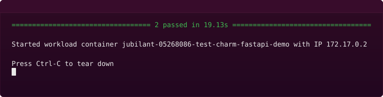

# jjx — Spin up K8s charms on Docker

jjx is an **experimental** test adapter for [Juju charms](https://canonical.com/juju/charms-architecture). It lets you run a charm's workload as a Docker container, with the charm's integration tests acting like a Compose file.



To be compatible with jjx, a K8s charm must use uv to manage its dependencies and have a dependency group called `integration`. jjx expects the integration tests to be located at `tests/integration` and use Jubilant with pytest-jubilant. For more detail about the expected structure, see [How to write integration tests for a charm](https://canonical.com/juju/docs/ops/latest/howto/write-integration-tests-for-a-charm/#write-your-tests).

**What's the point of jjx?**

*Speed* 💨

You can use jjx to quickly "run" a charm and play with its workload. No need to pack the charm or set up Juju.

**And what's the catch?**

The charm can't be too complex. If it requires storage, multiple units, or other charms, jjx might not work. The limitations are deliberately vague while jjx is a v0 tool.

## Demo

```sh
# Grab a simple K8s charm that requires a PostgreSQL database.
git clone https://github.com/canonical/operator.git
cd operator/examples/k8s-3-postgresql
charmcraft fetch-libs

# Run the workload, mapping localhost port 5000 to workload port 8000.
uvx jjx -p 5000:8000
```

Then play with the workload (in a second terminal):

```sh
curl localhost:5000/names  # returns {"names":{}}
curl -X POST -d 'name=elephant' localhost:5000/addname/
curl localhost:5000/names  # returns {"names":{"1":"elephant"}}
```

You can also interrogate Pebble using [borescope](https://github.com/tonyandrewmeyer/borescope):

```sh
uvx borescope --socket .jjx/socket
```

This gives you a prompt that feels like bash and has first-class support for Pebble commands. For example:

<pre>
<b>pebble:/#</b> ls api_demo_server/
__init__.py
app.py
database.py
<b>pebble:/#</b> services
<b>SERVICE</b>          <b>STARTUP</b>  <b>CURRENT</b>
fastapi-service  enabled  active
</pre>

For more detail, see [Command reference](https://borescope.dev/docs/reference-commands.html) in the borescope docs.

## System requirements

- **[uv](https://docs.astral.sh/uv/getting-started/installation/)** — To install on Ubuntu, run `sudo snap install astral-uv --classic`.
- **[Docker](https://docs.docker.com/engine/install/)** — To install on Ubuntu, run `sudo snap install docker`.

By default, Docker commands require `sudo`, but jjx runs Docker commands as a regular user. To allow Docker commands, run `sudo usermod -aG docker $USER`, then log out and log back in again.

## Usage

### Run the workload

In the charm dir:

```text
uvx jjx
```

This runs the charm's integration tests and starts a Docker container for the workload — assuming the integration tests try to deploy a `.charm` file along with a workload image. See [How jjx works](#how-jjx-works).

The workload stays running until you press Ctrl-C.

The command output includes the IP address of the workload. You can play with the workload by connecting to this address.

Alternatively, to play with the workload on localhost, specify a port mapping:

```text
uvx jjx -p <localhost-port>:<workload-port>
```

### Run the workload in the background

In the charm dir:

```text
uvx jjx -d
```

This does the same thing as `uvx jjx`, except the command exits and the workload stays running.

To stop the workload:

```text
uvx jjx down
```

### Set extra pytest options

jjx uses pytest to run the charm's integration tests. See [How jjx works](#how-jjx-works).

To set extra pytest options:

```text
uvx jjx -- <pytest-args>
```

For example:

```sh
# Enable verbose logging, to show more detail about each test.
uvx jjx -- -vv
```

To automatically include extra pytest options, use a `[tool.jjx]` table in `pyproject.toml`. For example:

```toml
[tool.jjx]
pytest-extra-args = ["-k", "test_deploy"]
```

## How jjx works

The `jjx` Python package provides a `juju` command that is partially compatible with the real `juju` command. Running `uvx jjx` in the charm dir is equivalent to:

```sh
touch placeholder.charm
uv run --group integration --with jjx pytest tests/integration --no-juju-teardown
rm placeholder.charm
```

When the integration tests try to deploy a `.charm` file along with a workload image, `juju` starts a container for the charm code. `juju` also starts a container for the workload and injects Pebble into the container. The charm code has access to the Pebble socket, as Ops expects.

Other Jubilant methods are handled by `juju` and routed to the charm code. For example, if an integration test calls `Juju.config()`, `juju` executes the charm code with its environment configured as a config-changed event. Ops recognizes the event and the charm code is able to apply the change using Pebble methods.

If the integration tests try to deploy [postgresql-k8s](https://charmhub.io/postgresql-k8s), `juju` starts a container for the official [postgres](https://hub.docker.com/_/postgres) image and mocks the behavior of charmed PostgreSQL K8s. Once integrated with "postgresql-k8s", the charm code thinks it's talking to a real remote unit.

In other words, everything is real from the perspective of the charm and its integration tests. The mocked parts are Juju, the cloud, and other charms.
